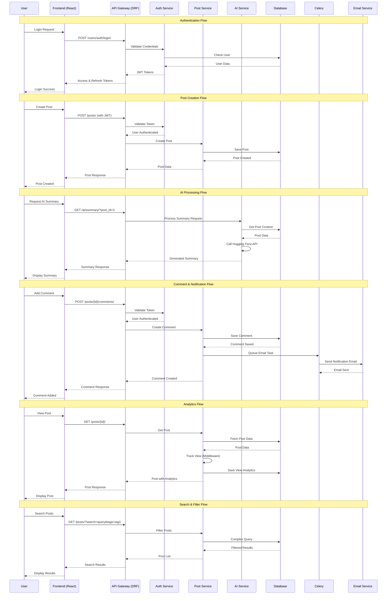

# API Flow Diagram - Melio Ink Smart

## API Endpoint Categories

### Authentication Endpoints
- `POST /users/auth/register/` - User registration
- `POST /users/auth/login/` - User login
- `POST /users/auth/access_token/` - Token refresh

### Post Management
- `GET /posts/` - List posts with filtering
- `POST /posts/` - Create new post
- `GET /posts/{id}/` - Get specific post
- `PUT /posts/{id}/` - Update post
- `DELETE /posts/{id}/` - Delete post
- `POST /posts/{id}/publish/` - Publish draft

### Social Features
- `POST /posts/{id}/like/` - Like/unlike post
- `GET /posts/{id}/likes/` - Get post likes
- `POST /posts/save_post/` - Save/unsave post
- `GET /posts/saved/` - Get saved posts

### Comments
- `GET /posts/{id}/comments/` - Get post comments
- `POST /posts/{id}/comments/` - Create comment
- `PUT /posts/{id}/comments/{id}/` - Update comment
- `DELETE /posts/{id}/comments/{id}/` - Delete comment
- `POST /posts/{id}/comments/{id}/like/` - Like comment

### AI Services
- `GET /ai/tags/?post_id={id}` - Get AI-generated tags
- `GET /ai/summary/?post_id={id}` - Get AI-generated summary

### Analytics
- `GET /posts/statistics/post_stats/{id}/` - Get post statistics
- `GET /posts/statistics/` - Get user statistics

## Key Features

### Authentication Flow
1. User provides credentials
2. Backend validates and returns JWT tokens
3. Frontend stores tokens for subsequent requests
4. Automatic token refresh on expiration

### AI Integration
1. User requests AI processing
2. Backend calls Hugging Face API
3. AI models process content
4. Results returned to user

### Real-time Features
1. User interactions trigger immediate updates
2. Background tasks handle notifications
3. Analytics tracking happens automatically
4. Search and filtering provide instant results
