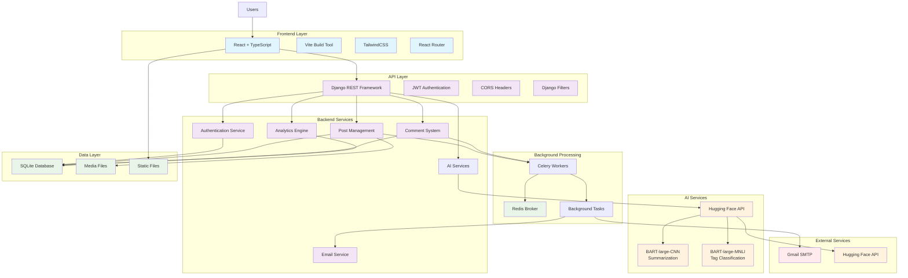

# System Architecture Diagram - Melio Ink Smart

## Architecture Components

### Frontend Layer
- **React + TypeScript**: Modern UI framework with type safety
- **Vite**: Fast build tool and development server
- **TailwindCSS**: Utility-first CSS framework
- **React Router**: Client-side routing

### API Layer
- **Django REST Framework**: RESTful API development
- **JWT Authentication**: Secure token-based authentication
- **CORS Headers**: Cross-origin resource sharing
- **Django Filters**: Advanced filtering capabilities

### Backend Services
- **Authentication Service**: User management and JWT handling
- **Post Management**: CRUD operations for blog posts
- **Comment System**: Nested commenting with likes
- **AI Services**: Content summarization and tagging
- **Analytics Engine**: User and post statistics
- **Email Service**: Notification system

### AI Integration
- **Hugging Face API**: External AI model service
- **BART-large-CNN**: Content summarization
- **BART-large-MNLI**: Tag classification

### Background Processing
- **Celery**: Distributed task queue
- **Redis**: Message broker and caching
- **Background Tasks**: Email notifications, AI processing

### Data Layer
- **SQLite**: Primary database (PostgreSQL in production)
- **Media Files**: User uploads and post images
- **Static Files**: Frontend assets

## Data Flow

1. **User Request**: Frontend sends HTTP request to Django API
2. **Authentication**: JWT token validation
3. **Business Logic**: Django services process request
4. **AI Processing**: Background tasks for AI features
5. **Data Persistence**: Database operations
6. **Response**: JSON response to frontend
7. **UI Update**: React components update based on response
