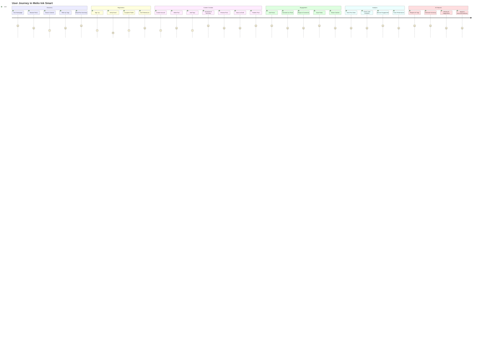
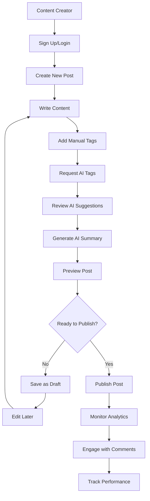
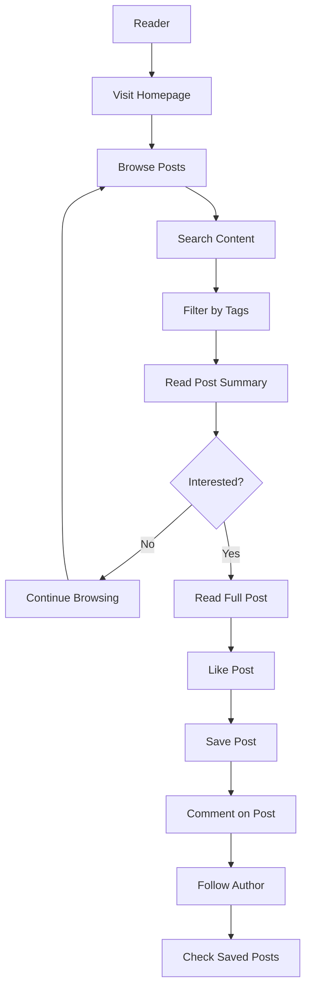
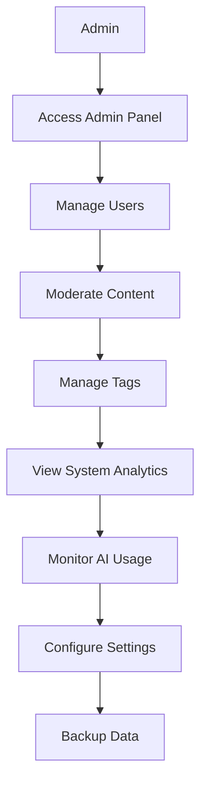

# User Journey Diagram - Melio Ink Smart

## Detailed User Personas

### Content Creator Journey

### Reader Journey

### Admin Journey

## Key User Touchpoints

### 1. Content Discovery
- **Homepage**: Curated post feed with AI summaries
- **Search**: Full-text search across content and authors
- **Tag Filtering**: Category-based content discovery
- **Trending**: Popular and engaging content

### 2. Content Creation
- **Rich Editor**: Markdown-based post creation
- **AI Assistance**: Automated tagging and summarization
- **Draft System**: Save and publish workflow
- **Preview Mode**: See post before publishing

### 3. Social Interaction
- **Liking System**: Express appreciation for content
- **Commenting**: Nested discussion system
- **Bookmarking**: Save posts for later reading
- **Sharing**: Social media integration

### 4. Analytics & Insights
- **Post Analytics**: Views, likes, comments tracking
- **User Statistics**: Performance metrics
- **Engagement Trends**: Monthly breakdowns
- **AI Usage**: Track AI feature utilization

### 5. AI-Powered Features
- **Smart Tagging**: AI-generated tag suggestions
- **Content Summarization**: Automatic post summaries
- **Content Analysis**: Intelligent content categorization
- **Recommendation Engine**: Personalized content suggestions

## User Experience Highlights

### Seamless Onboarding
1. Quick registration process
2. Profile setup with preferences
3. Guided tour of features
4. Sample content to explore

### Intuitive Content Creation
1. Clean, distraction-free editor
2. Real-time preview
3. AI-powered assistance
4. Draft management system

### Engaging Social Features
1. Easy like and comment system
2. Nested comment replies
3. Bookmark organization
4. User profile exploration

### Comprehensive Analytics
1. Visual data representation
2. Performance insights
3. Engagement tracking
4. Growth metrics

### AI-Enhanced Experience
1. Intelligent content suggestions
2. Automated summarization
3. Smart categorization
4. Personalized recommendations
